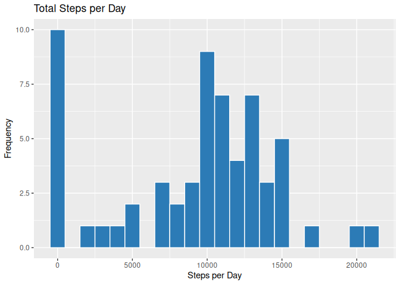
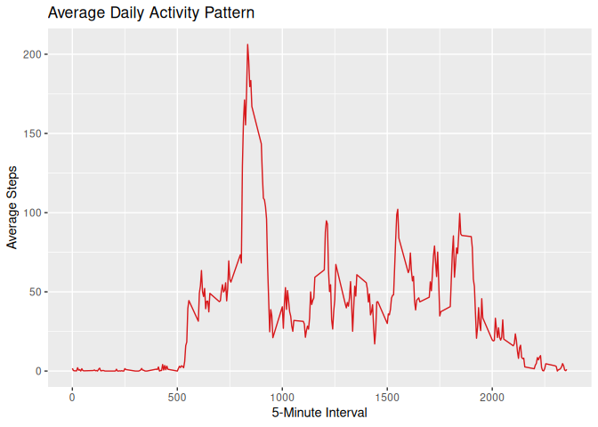
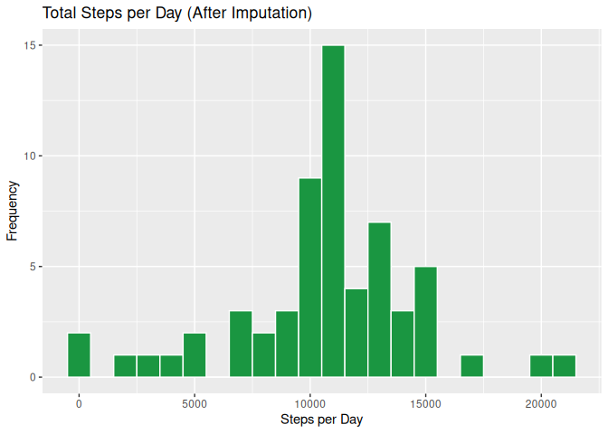
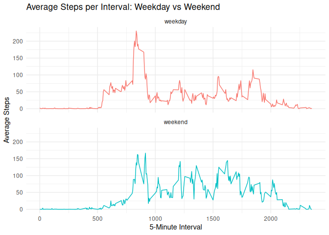

---
title: "PA1_template.Rmd"
author: MikeB
date: "2025-11-03"
output: 
  html_document:
    keep_md: true
---


## Loading packages all at one time. Added extras just in case.   


``` r
# Load all packages at one time (added extras just in case)
pkgs <- c("ggplot2","dplyr","tidyr","readr","purrr","tibble","stringr","forcats",
          "lubridate","knitr","rmarkdown","gridExtra","scales")
install_if_missing <- function(pkg) if (!requireNamespace(pkg, quietly = TRUE)) 
  install.packages(pkg, repos = "https://cloud.r-project.org")
invisible(lapply(pkgs, install_if_missing))
invisible(lapply(pkgs, library, character.only = TRUE))
```

## Loading and Preprocessing the data.

``` r
unzip("activity.zip")

activity <- readr::read_csv(
  "activity.csv",
  col_types = readr::cols(
    steps    = readr::col_double(),
    date     = readr::col_date(format = "%Y-%m-%d"),
    interval = readr::col_integer()
  )
)

# Quick glance at structure
glimpse(activity)
```

```
## Rows: 17,568
## Columns: 3
## $ steps    <dbl> NA, NA, NA, NA, NA, NA, NA, NA, NA, NA, NA, NA, NA, NA, NA, N…
## $ date     <date> 2012-10-01, 2012-10-01, 2012-10-01, 2012-10-01, 2012-10-01, …
## $ interval <int> 0, 5, 10, 15, 20, 25, 30, 35, 40, 45, 50, 55, 100, 105, 110, …
```

``` r
# Count total missing values
sum(is.na(activity$steps))
```

```
## [1] 2304
```

## What is mean total number of steps taken per day?

## Calculates "Total Daily Steps" while ignoring missing values.
## Plots a simple, clean Histogram.


``` r
# Calculate total steps per day -------------------------------------------
daily_steps <- activity %>%
  group_by(date) %>%
  summarise(total_steps = sum(steps, na.rm = TRUE))

# Histogram of total daily steps ------------------------------------------
ggplot(daily_steps, aes(x = total_steps)) +
  geom_histogram(binwidth = 1000, fill = "#2c7bb6", color = "white") +
  labs(title = "Total Steps per Day",
       x = "Steps per Day",
       y = "Frequency")
```

<!-- -->

``` r
# Mean and median total steps per day -------------------------------------
mean_steps <- mean(daily_steps$total_steps)
median_steps <- median(daily_steps$total_steps)

mean_steps
```

```
## [1] 9354.23
```

``` r
median_steps
```

```
## [1] 10395
```

## What is the average daily activity pattern?

``` r
# Calculate the average number of steps for each 5-minute interval ---------
avg_interval <- activity %>%
  group_by(interval) %>%
  summarise(avg_steps = mean(steps, na.rm = TRUE))

# Time series plot of the average steps per interval -----------------------
ggplot(avg_interval, aes(x = interval, y = avg_steps)) +
  geom_line(color = "#d7191c") +
  labs(title = "Average Daily Activity Pattern",
       x = "5-Minute Interval",
       y = "Average Steps")
```

<!-- -->

``` r
# Identify the interval with the maximum average steps ---------------------
avg_interval %>% 
  filter(avg_steps == max(avg_steps))
```

```
## # A tibble: 1 × 2
##   interval avg_steps
##      <int>     <dbl>
## 1      835      206.
```

## Imputing Missing Values

``` r
# Count missing values -----------------------------------------------------
sum(is.na(activity$steps))
```

```
## [1] 2304
```

``` r
# Compute mean steps for each interval ------------------------------------
interval_means <- activity %>%
  group_by(interval) %>%
  summarise(mean_steps = mean(steps, na.rm = TRUE))

# Fill in missing step values using interval means ------------------------
activity_imputed <- activity %>%
  left_join(interval_means, by = "interval") %>%
  mutate(steps = if_else(is.na(steps), mean_steps, steps)) %>%
  select(date, interval, steps)

# Verify that no NAs remain ------------------------------------------------
sum(is.na(activity_imputed$steps))
```

```
## [1] 0
```
## Histogram and Statistics after imputing missing values

``` r
# Total steps per day after imputation ------------------------------------
daily_steps_imputed <- activity_imputed %>%
  group_by(date) %>%
  summarise(total_steps = sum(steps))

# Histogram of total daily steps after imputation -------------------------
ggplot(daily_steps_imputed, aes(x = total_steps)) +
  geom_histogram(binwidth = 1000, fill = "#1a9641", color = "white") +
  labs(title = "Total Steps per Day (After Imputation)",
       x = "Steps per Day",
       y = "Frequency")
```

<!-- -->

``` r
# Mean and median after imputation ----------------------------------------
mean_imputed <- mean(daily_steps_imputed$total_steps)
median_imputed <- median(daily_steps_imputed$total_steps)

mean_imputed
```

```
## [1] 10766.19
```

``` r
median_imputed
```

```
## [1] 10766.19
```

## Are there differences in activity patterns between weekdays and weekends?

``` r
# Add a new factor variable for day type -----------------------------------
activity_imputed <- activity_imputed %>%
  mutate(day_type = if_else(wday(date) %in% c(1, 7), "weekend", "weekday"))

# Compute average steps by interval and day type ---------------------------
avg_by_daytype <- activity_imputed %>%
  group_by(day_type, interval) %>%
  summarise(avg_steps = mean(steps))
```

```
## `summarise()` has grouped output by 'day_type'. You can override using the
## `.groups` argument.
```

``` r
# Plot average steps for weekdays vs weekends ------------------------------
ggplot(avg_by_daytype, aes(x = interval, y = avg_steps, color = day_type)) +
  geom_line() +
  facet_wrap(~day_type, ncol = 1) +
  labs(title = "Average Steps per Interval: Weekday vs Weekend",
       x = "5-Minute Interval",
       y = "Average Steps") +
  theme_minimal() +
  theme(legend.position = "none")
```

<!-- -->

## Thank You
